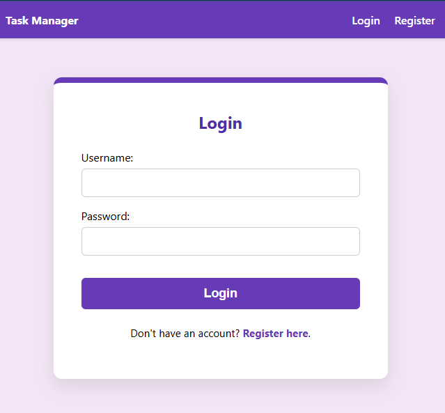
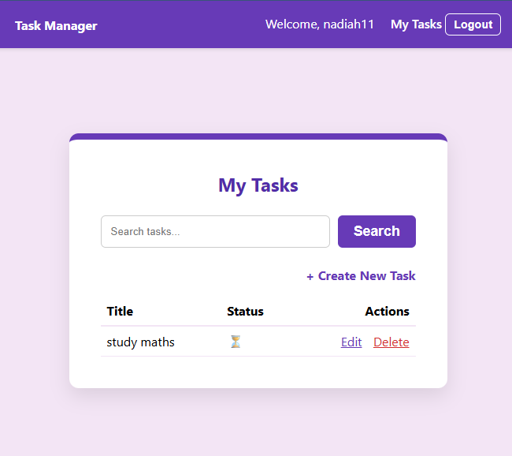
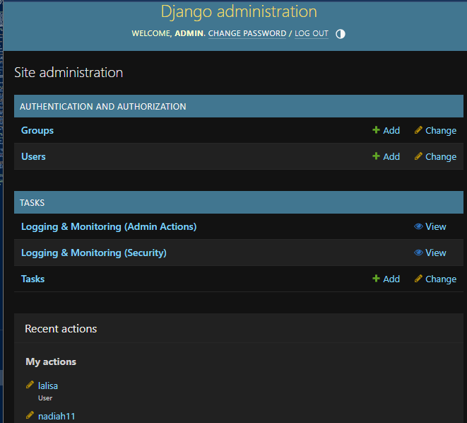

# Secure Task Manager

## 1. Project Description
The Secure Task Manager is a robust Django-based web application designed with a "Security First" philosophy. It provides a platform for users to manage their personal tasks while ensuring data integrity, confidentiality, and availability. The system implements a comprehensive audit logging to meet modern security standards (OWASP ASVS).

## 2. Installation Steps
Follow these steps to set up the project locally:

1. **Clone the repository:**
   ```bash
   git clone <repository-url>
   cd task_manager
   ```
2. **Create and activate a virtual environment:**
   ```bash
   python -m venv venv
   # Windows:
   venv\Scripts\activate
   # macOS/Linux:
   source venv/bin/activate
   ```
3. **Install dependencies:**
   ```bash
   pip install django python-dotenv whitenoise argon2-cffi
   ```
4. **Environment Configuration:**
   Create a `.env` file in the root directory and add:
   ```env
   SECRET_KEY=your-very-secure-secret-key
   DEBUG=False
   ALLOWED_HOSTS=127.0.0.1,localhost
   ```
5. **Database Setup:**
   ```bash
   python manage.py makemigrations
   python manage.py migrate
   ```
6. **Static Files:**
   ```bash
   python manage.py collectstatic --noinput
   ```

## 3. Security Features Summary
*   **Insecure Direct Object Reference (IDOR) Prevention:** All task queries are filtered by the authenticated user (`owner`).
*   **Role-Based Access Control (RBAC):** Admins are isolated to the `/admin/` panel, while regular users are restricted to the task management interface.
*   **Audit Logging & Monitoring:** 
    *   **Security Events:** Tracks successful logins, logouts, and failed login attempts (including IP and User Agent).
    *   **Admin Actions:** Tracks all changes made by staff members within the admin panel.
*   **Input Validation:** Strict `RegexValidator` implementation on models and forms to prevent XSS and Injection attacks.
*   **Secure Session Management:** 20-minute session expiry, `HttpOnly`, and `Strict` SameSite cookies.
*   **Password Security:** Uses `Argon2` hashing and enforces a 12-character minimum length with complexity requirements.
*   **Custom Error Handling:** Professional 400, 403, 404, and 500 error pages to prevent system information leakage.

## 4. How to Run the App
Start the development server:
```bash
python manage.py runserver
```
*   Access the User App: `http://127.0.0.1:8000/`
*   Access the Admin Panel: `http://127.0.0.1:8000/admin/`

## 5. Dependencies
*   **Django**: Web framework.
*   **python-dotenv**: Environment variable management.
*   **WhiteNoise**: Efficient static file serving for `DEBUG=False`.
*   **argon2-cffi**: Advanced password hashing.

## 6. Screenshots
## 1. Login Page

### 2. User Dashboard

## 3. Admin Dashboard


---

